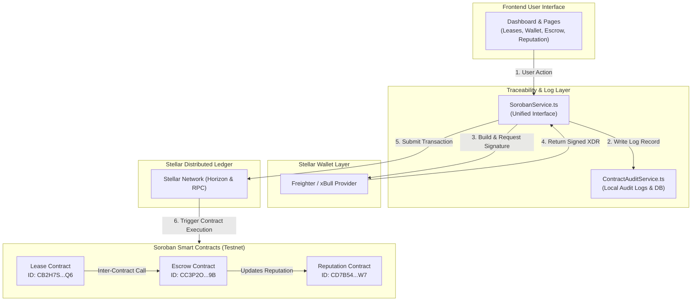

# ChainRent Smart Contract Architecture & Integration Traceability

This document details how the frontend operations map to Soroban smart contract functions, along with the system architecture and transaction flow.

## 1. Frontend-to-Contract Mapping

Every interactive user action on the frontend corresponds to a distinct smart contract method. The table below traces these actions:

| Frontend Feature / Action | Service Method Invoked | Target Contract | Smart Contract Function |
|---|---|---|---|
| **Initialize Lease** | `SorobanService.createLease` | Lease Contract | `create_lease(property_id, tenant, landlord, rent, deposit, duration)` |
| **Approve Lease Agreement** | `SorobanService.approveLease` | Lease Contract | `approve_lease(lease_id, landlord)` |
| **Lock Security Deposit** | `SorobanService.lockDeposit` | Escrow Contract | `lock_deposit(lease_id, tenant, amount)` |
| **Settle Rent Payment** | `SorobanService.payRent` | Lease/Payment Contract | `pay_rent(lease_id, tenant, landlord, amount)` |
| **Release Escrow Deposit** | `SorobanService.releaseDeposit` | Escrow Contract | `release_deposit(lease_id, recipient, amount, signatures)` |
| **Refund Escrow Deposit** | `SorobanService.refundDeposit` | Escrow Contract | `refund_deposit(lease_id, tenant, amount)` |
| **Terminate Lease Agreement** | `SorobanService.terminateLease` | Lease Contract | `terminate_lease(lease_id)` |
| **Log Settlement / Reputation** | `SorobanService.updateReputation` | Reputation Contract | `update_score(address, role, success)` |
| **Fetch Lease Details** | `SorobanService.getLease` | Lease Contract | `get_lease(lease_id)` |
| **Fetch Escrow Balance** | `SorobanService.getEscrow` | Escrow Contract | `get_escrow(lease_id)` |
| **Fetch User Trust Score** | `SorobanService.getReputation` | Reputation Contract | `get_reputation(address)` |

---

## 2. System Architecture Diagram

The integration flow passes from the user interface down through the wallet connector, contract service layers, and onto the Stellar Network nodes:

---

## 3. Transaction Lifecycle Flow

1. **Transaction Building**: The frontend components build the operation using `@stellar/stellar-sdk` and prompt the user to sign the payload.
2. **Wallet Signing**: The Freighter or xBull wallet extension intercepts the transaction, displays the details to the user, and signs the XDR payload securely.
3. **Execution & Traceability**: The signed XDR is sent to the `SorobanService` which writes an execution audit record to the local storage audit logs via `ContractAuditService`.
4. **On-Chain Processing**: The transaction is submitted to the Stellar Testnet RPC. Once validated by the network, the corresponding Soroban smart contract is invoked, updating state (Lease status, Escrow balances, and Reputation scores).
