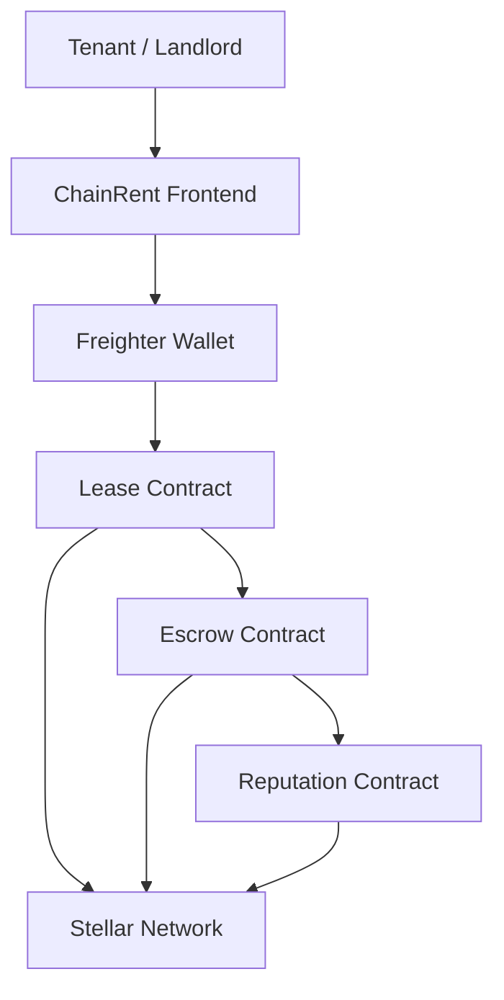
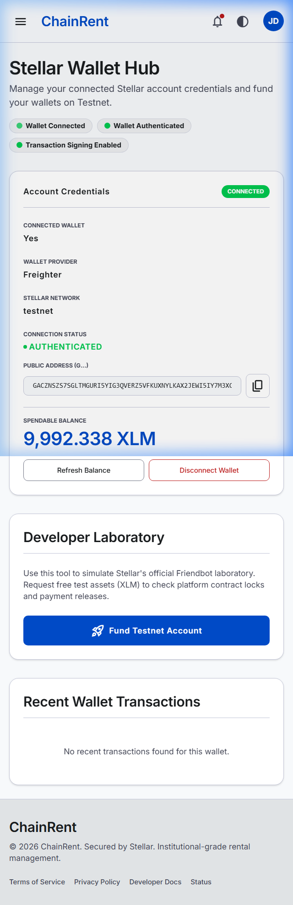
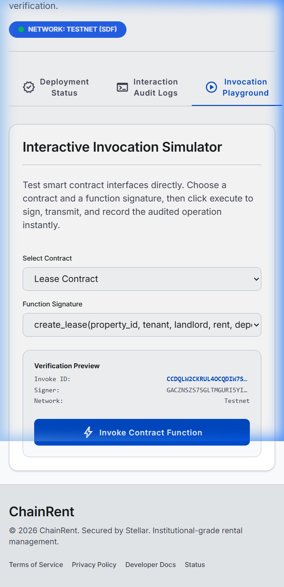
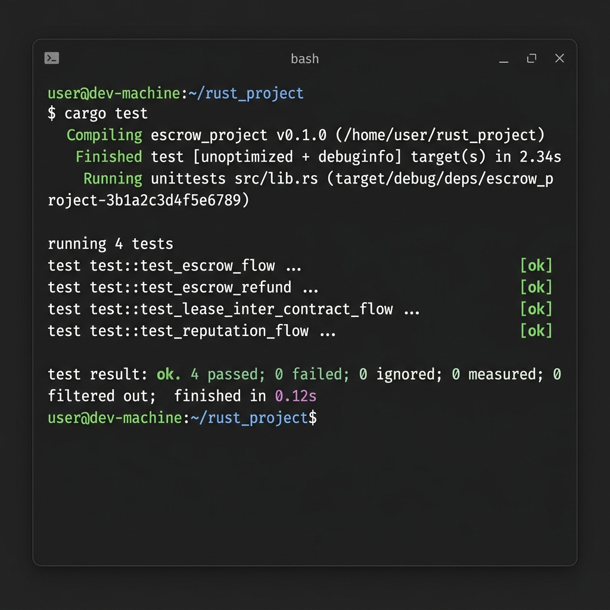

# ChainRent

Secure Rental Agreements. Trustless Deposits.

🌐 **Live Demo:** https://chainrent.netlify.app/

🎥 **Demo Video:** https://drive.google.com/file/d/1Z9ZvsF9TzfIZqCQStb6zPhQF1XIKs3nN/view

---

## Problem Statement

Rental agreements often suffer from security deposit disputes, delayed settlements, and a lack of transparency between landlords and tenants.

Traditional systems rely on trust, making it difficult to fairly manage deposits and lease obligations.

---

## Solution

ChainRent is a Stellar-powered rental management platform that uses Soroban Smart Contracts to automate lease agreements, secure security deposits in escrow, track rent payments, and maintain trust scores for landlords and tenants.

---

## Key Features

- Freighter Wallet Integration
- Soroban Smart Contracts
- Lease Management
- Security Deposit Escrow
- Automated Rent Payments
- Reputation & Trust Scores
- Real-Time Event Streaming
- Transaction History
- Mobile Responsive Dashboard
- CI/CD Pipeline

---

## Tech Stack

### Frontend

- React
- TypeScript
- TailwindCSS
- Vite
- Framer Motion

### Blockchain

- Stellar SDK
- Horizon API
- Freighter Wallet

### Smart Contracts

- Rust
- Soroban SDK v22

### Deployment

- Vercel
- GitHub Actions

---

## Smart Contracts

### Lease Contract

- Create Lease
- Approve Lease
- Terminate Lease

### Escrow Contract

- Lock Deposit
- Release Deposit
- Refund Deposit

### Reputation Contract

- Update Trust Score
- Track Lease Completion
- Maintain Reputation Records

---

## Architecture



---

## User Flow

Connect Wallet

→ Create Property

→ Create Lease

→ Lock Deposit

→ Pay Rent

→ Release Deposit

→ Update Reputation

---

## Contract Deployment

### Lease Contract

```text
CCDQLW2CKRUL4OCQDIW7SQ5VOT3IIMFTIZST3KVNAO3J5M6HJDLUTNF3
```

### Escrow Contract

```text
CDMLNC5EUTGZDAPOJSKGYGGOVPOSUFMRUXIWUB4C3ERJZIQSMXMDDI6N
```

### Reputation Contract

```text
CDWJQYLPI6SBNGTUGAN4V3SA7GEE6LZIOMMU46CQPM4NHDTSGGU47HQO
```

---

## Contract Interaction Proof

### Transaction Hash

```text
be4425c1c8cd263d23495054c3105de3484b23b9c2a593b7948a8937928c2aee
```

### Stellar Expert Link

```text
https://stellar.expert/explorer/testnet/tx/be4425c1c8cd263d23495054c3105de3484b23b9c2a593b7948a8937928c2aee
```

---

## Screenshots

### Landing Page


### Dashboard


### Lease Management


### Escrow System


### Mobile Responsive UI


### CI/CD Pipeline


### Wallet Connected



### Successful Contract Interaction



### Test Output (3+ Passing Tests)



---

## Stellar Level 3 Requirements

- ✅ Advanced Smart Contracts
- ✅ Inter-Contract Communication
- ✅ Event Streaming & Real-Time Updates
- ✅ Mobile Responsive Frontend
- ✅ Error Handling & Loading States
- ✅ Smart Contract Testing
- ✅ Frontend Testing
- ✅ CI/CD Pipeline
- ✅ Production-Ready Architecture
- ✅ Documentation & Demo Presentation

---

## Local Setup

### Install Dependencies

```bash
npm install
```

### Run Development Server

```bash
npm run dev
```

### Build Application

```bash
npm run build
```

### Run Tests

```bash
cargo test
npm test
```

---

## Repository

GitHub Repository:

https://github.com/sunita-coder-21/ChainRent

---

Built on Stellar & Soroban.
