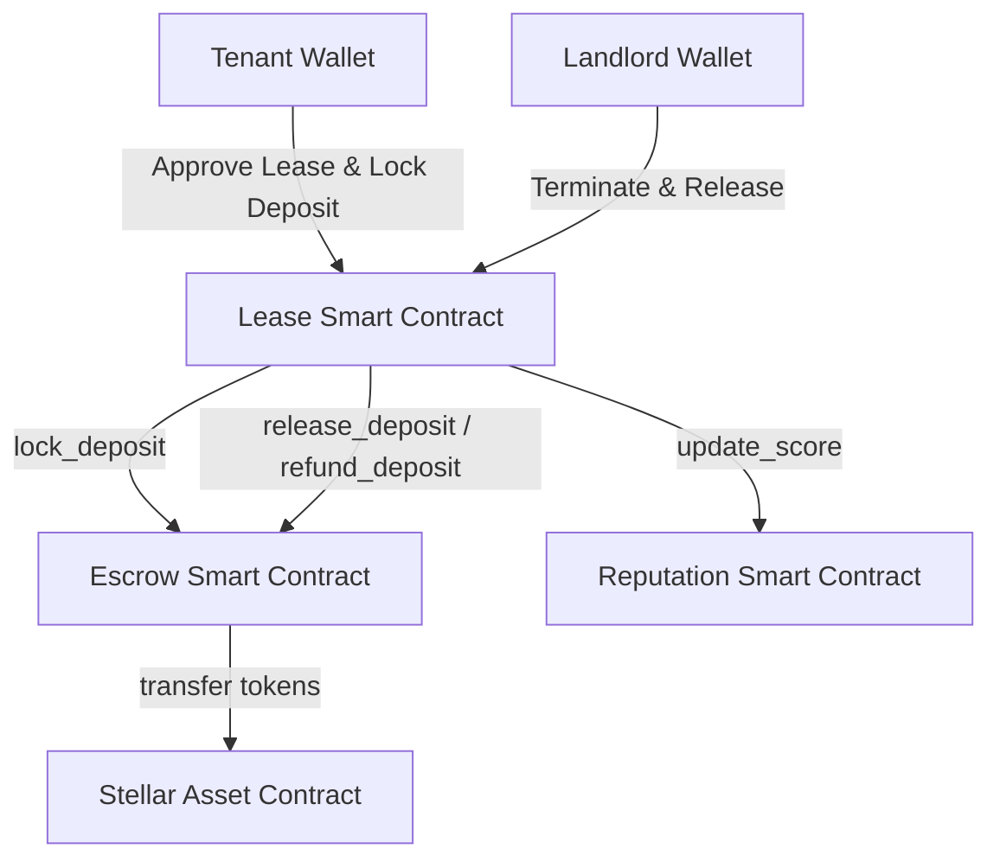
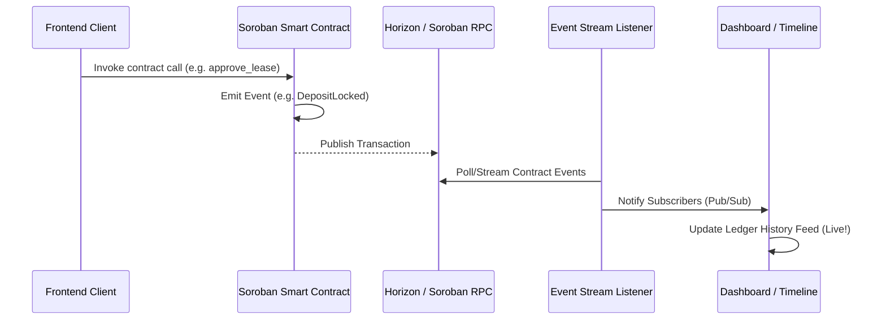

# ChainRent — Soroban Level 3 Web3 Rental Platform

[](https://github.com/arya-bhagat/chainrent/actions/workflows/ci.yml)
[](https://soroban.stellar.org/)
[](LICENSE)

ChainRent is a decentralized rental management dApp built on the **Stellar network** using **Soroban smart contracts (v22)**. It provides a secure, trustless system for leasing properties, locking security deposits in escrow, tracking automated rent payments, and updating landlord/tenant reputation scores based on contract settlements.

---

## 🏗️ Smart Contract Architecture

The core on-chain logic is split into three modular Rust smart contracts located under `contracts/`:



### 1. Lease Contract (`contracts/lease`)
* Manages the lifecycle of agreements (`Created`, `Active`, `Terminated`).
* Orchestrates deposit locking by calling the Escrow Contract.
* Resolves agreements and triggers reputation updates by calling the Reputation Contract.

### 2. Escrow Contract (`contracts/escrow`)
* Acts as a secure custody vault for security deposits.
* Implements token transfer rules, moving locked deposits between tenant, landlord, or holding balance during dispute arbitration.

### 3. Reputation Contract (`contracts/reputation`)
* Records successful lease completions to boost trust scores.
* Applies penalizations or records breaches to dynamically calculate trust metrics.

---

## 📡 On-Chain Event Streaming & Logging

Soroban smart contracts publish events for all state changes. The frontend application listens to these events to dynamically update dashboards, timelines, and ledger history tables.



### Supported Event Types:
* `LeaseCreated`: Published when a landlord defines lease terms.
* `LeaseApproved`: Emitted when the tenant signs and activates the lease.
* `DepositLocked`: Published when tokens are successfully moved into the Escrow Contract.
* `DepositReleased`: Emitted when deposit is refunded to the tenant or released to the landlord.
* `RentPaid`: Emitted on successful monthly rent payment settlement.
* `ReputationUpdated`: Published when a user's trust score changes.

---

## 🛠️ Developer Setup & Commands

### Prerequisites
* Rust toolchain (stable) with `wasm32-unknown-unknown` target.
* Node.js v18+ and npm.
* Soroban CLI (v22).

### 1. Build and Test Smart Contracts
Run checks and test suite locally:
```bash
# Clean build artifacts
cargo clean --manifest-path contracts/Cargo.toml

# Build contracts to WASM bytecode
cargo build --manifest-path contracts/Cargo.toml --target wasm32-unknown-unknown --release

# Run unit and inter-contract test suite
cargo test --manifest-path contracts/Cargo.toml
```

### 2. Run Frontend Web App Locally
Start the local development server:
```bash
# Install NPM dependencies
npm install

# Start Vite hot-reload server
npm run dev
```

### 3. Compile and Typecheck Frontend
```bash
npm run build
```

---

## 🚀 GitHub Actions CI/CD Pipeline

The `.github/workflows/ci.yml` pipeline automatically runs on every push and pull request to verify compilation and test integrity:
1. **Lint/Format Check**: Validates Rust code style.
2. **Build Smart Contracts**: Compiles contracts to WASM target.
3. **Execute Test Suite**: Runs all unit tests and inter-contract workflows.
4. **Build Frontend**: Packages the React Vite application for deployment.
