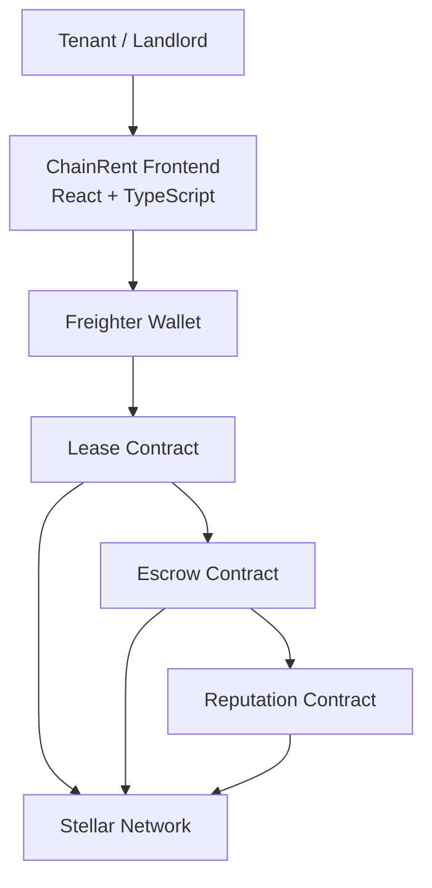

# ChainRent
Secure Rental Agreements. Trustless Deposits.

**[Watch the Stellar Demo Video]( )**

## Problem Statement

Rental agreements often suffer from security deposit disputes, delayed settlements, and a lack of transparency between landlords and tenants.

Traditional systems rely on trust, making it difficult to fairly manage deposits and lease obligations.

## Solution

ChainRent is a Stellar-powered rental management platform that uses Soroban Smart Contracts to automate lease agreements, secure security deposits in escrow, track rent payments, and maintain trust scores for landlords and tenants.

## Key Features

- Freighter Wallet Integration
- Soroban Smart Contracts
- Lease Management
- Security Deposit Escrow
- Automated Rent Payments
- Reputation & Trust Scores
- Real-Time Event Tracking
- Transaction History
- Responsive Dashboard
- CI/CD Pipeline

## Tech Stack

### Frontend

- React
- TypeScript
- TailwindCSS
- Vite
- Framer Motion

### Blockchain

- Stellar SDK
- Soroban Smart Contracts
- Horizon API
- Freighter Wallet

### Smart Contracts

- Rust
- Soroban SDK v22

### DevOps

- GitHub Actions
- Vercel

## Architecture



## User Flow

Connect Wallet

→ Create Property

→ Create Lease

→ Lock Deposit

→ Pay Rent

→ Release Deposit

→ Update Reputation

## Smart Contracts

### Lease Contract

- Create Lease
- Approve Lease
- Terminate Lease

### Escrow Contract

- Lock Deposit
- Release Deposit
- Refund Deposit

### Reputation Contract

- Update Trust Score
- Track Lease Completion
- Maintain Reputation Records

## Screenshots

### Landing Page


### Dashboard


### Lease Management


### Escrow System


### Mobile UI


### CI/CD


## Stellar Level 3 Requirements

- ✅ Advanced Smart Contracts
- ✅ Inter-Contract Communication
- ✅ Event Streaming
- ✅ Mobile Responsive UI
- ✅ Testing
- ✅ CI/CD Pipeline
- ✅ Production Architecture
- ✅ Documentation

## Setup

```bash
npm install
npm run dev
```

## Build

```bash
npm run build
```


Built on Stellar & Soroban.
